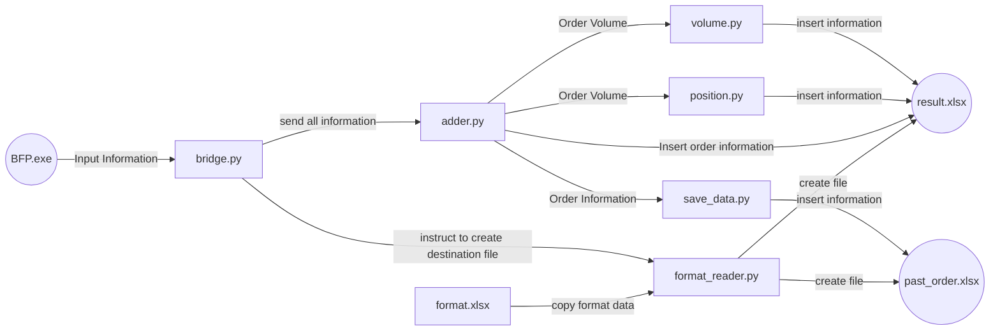

# Biofoundry palette

  
 

Biofoundry Palette is a python-based planning-assistance software for synthetic biology applications in an automated workflow and biofoundry facilities, enabling automated high-throughput experiments. The program in this repository is for liquid handler-based experimentation and operation in the biofoundry workflow.

## Installation and Execution
Biofoundry Palette Program does not require any additional installation. In order to execute the file, a please click BFP.exe
**Operation Instruction**
-OPERATOR: place the name of the person running the machine
- CLIENT: place the name of the customer
- ORDER ID: place the name of ther order identification
- ORDER VOLUME: place the amount of the order
- NEW/OLD WELL: choice of using old/used well
- WELL ID: place the identification of old/used well
- WELL POSITION: starting column position of the well
- STEP: steps (step 11 is golden gate assembly)
- ORDER DATE: date of order is placed
- DEADLINE: date of product to be sent
- FILE NAME: name of the instruction file

However, when if one wants to run using raw python script, please install the following python packages

**Pre-requisites:**
The following commands is to be executed in Windows Powershell
 
[openpyxl](https://openpyxl.readthedocs.io/en/stable/)
| OS | Command |
| ----------- | ----------- |
| Windows | pip install openpyxl |

[xlsxwriter](https://xlsxwriter.readthedocs.io/)
| OS | Command |
| ----------- | ----------- |
| Windows | pip install xlsxwriter |

[tkcalendar](https://pypi.org/project/tkcalendar/)
| OS | Command |
| ----------- | ----------- |
| Windows | pip install tkcalendar |

[tkcalendar](https://docs.python.org/ko/3/library/tkinter.html)
| OS | Command |
| ----------- | ----------- |
| Windows | pip install tkinter |

## The following is flowchart of Biofoundry Palette

**Formulation used in position.py and volume.py**

  
 

## Publishing
The repository is set up to prohibit commits directly to the main branch. GitHub PRs must be approved by at least one other developer before they can be merged into main branch.

## Additional Information
To learn more about Biofoundry Palette, including program edittaion instructions and documentation, visit [BioFoundry Research Center](https://swb.skku.edu/BioFoundryRC/index.do).
